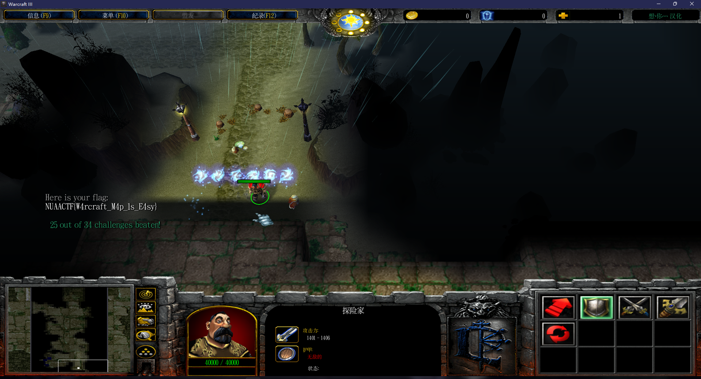
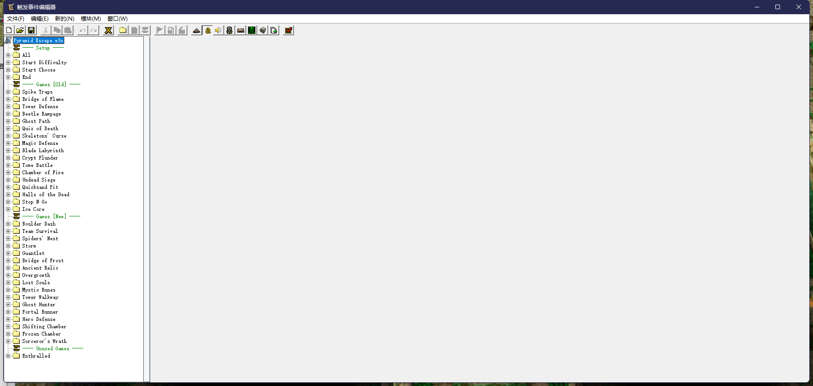
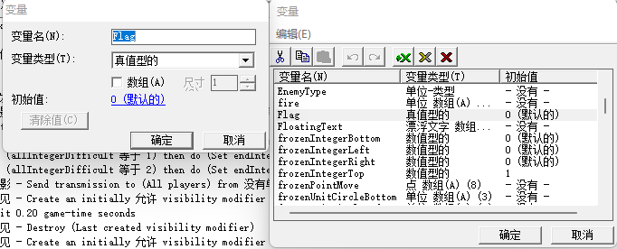

## Pyramid Escape Writeup


这是一道修改自魔兽争霸3：冰封王座经典自定义闯关地图《金字塔大逃亡》的游戏题，~~出这道游戏题的目的是为了让选手在比赛坐牢的情况下也能找点事做~~，不过这次比赛似乎玩的人并不多，下次争取出的简单明了一点，能够一键运行起来的那种。


### 做法

#### 打通关

根据题目描述所说，完成34个挑战通关后即可获得flag，直接打开war3，创建房间开始游戏即可。
根据我个人的通关经验，本地图单通还是相当困难的，主要有些关卡是在考虑人数较多的情况下设计的（比如塔防关），~~不过当时想的比赛的时候实验室有局域网可以跨队伍开个人多的房间也不是不可以嘛。~~


#### 修改器

作为一款老游戏，魔兽争霸3有非常多修改器，随便搜索一下就可以找到。比如
[这一款](https://github.com/tctianchi/War3Trainer)。或者干脆开单人模式使用秘籍whosyourdaddy也可乱杀通关。(其实我就是出完题目拿修改器测试能否正常通关的)



#### 逆向

作为一款修改之后的地图，稍加猜测可以得出是将flag放入地图文件的某一逻辑中，当到达通关条件时，将flag输出这一流程。以“魔兽争霸3 地图 修改”为关键词进行搜索可以得知魔兽争霸3游戏目录下自带地图编辑器`worldedit.exe`，打开后选择打开地图Pyramid Escape.w3x即可开始分析。随后搜索“魔兽争霸3 地图编辑器 教程”等关键词可以获得更多的相关信息。

例如[这些文章](https://blog.csdn.net/u013412391/category_9878426.html)就可以拿来做逆向的参考。
其中的第四篇《触发器与变量》中有提到

> “触发器”代表了一种逻辑：
在特定时机并且满足限定条件下需要进行的一系列操作

似乎与flag有些相关，输出flag的过程就是在满足**通关条件**的时候**输出**一个字符串flag。于是可以照着他文章的说明打开触发器编辑器，会发现里面有很多的触发器

可以一个个文件夹点开查看，也可以根据实际猜测：通关后输出flag，应该是在`End`或者`All`目录下。

可以在End目录下看到有个很明显的outputFlag触发器，点开后发现和别的触发器的明显的文字说明形式不同，是代码形式的，flag逻辑就在这里。

将里面的代码全都复制出来查看，会发现虽然很长，但是大多是数组的赋值内容，和flag相关的代码在最下面

```java
local integer array flag
    local integer i=1
    set flag[0]=78
    set flag[1]=27
    set flag[2]=20
    set flag[3]=0
    set flag[4]=2
    set flag[5]=23
    set flag[6]=18
    set flag[7]=61
    set flag[8]=44
    set flag[9]=99
    set flag[10]=70
    set flag[11]=17
    set flag[12]=17
    set flag[13]=19
    set flag[14]=7
    set flag[15]=18
    set flag[16]=43
    set flag[17]=18
    set flag[18]=121
    set flag[19]=68
    set flag[20]=47
    set flag[21]=110
    set flag[22]=66
    set flag[23]=44
    set flag[24]=26
    set flag[25]=113
    set flag[26]=71
    set flag[27]=10
    set flag[28]=4
    loop
        exitwhen i==29
        set flag[i] = B_XOR(flag[i],flag[i-1])
        set i=i+1
        
    endloop
    set i=0
    
    loop
        exitwhen i==29
        set s=s+Ascii2Char(flag[i])
        set i=i+1
        // body
    endloop
    call DisplayTextToPlayer(GetLocalPlayer(), 0,0, "Here is your flag:")
    call DisplayTextToPlayer(GetLocalPlayer(), 0,0, s)

```
逻辑很容易懂，是初始化了一个flag数组，随后循环i从1到29，将每一字节flag和前一字节进行`B_XOR`运算，随后将flag使用`Ascii2Char`转换成字符串后`DisplayTextToPlayer`输出。
`B_XOR`很明显是异或运算，最后直接写一个python脚本复现上述操作即可得到flag

```python
flag = [78, 27, 20, 0, 2, 23, 18, 61, 44, 99, 70, 17, 17, 19, 7, 18, 43, 18, 121, 68, 47, 110, 66, 44, 26, 113, 71, 10, 4]

for i in range(1,len(flag)):
    flag[i] = flag[i] ^ flag[i-1]
print("".join([chr(x) for x in flag]))
print(len(flag))
# NUAACTF{W4rcraft_M4p_1s_E4sy}
```

#### 补充

在逆向时其实还有一种做法，就是尝试手动去修改`outputFlag`的触发条件或者让它一进游戏就触发输出flag。查看别的模块化的非代码形式的触发器可以发现<事件>一栏是触发条件；<动作>一栏是满足触发条件之后执行的指令。
在`outputFlag`中，对应的是这一段

```java
function InitTrig_OutputFlag takes nothing returns nothing
    set gg_trg_OutputFlag = CreateTrigger(  )
    call TriggerRegisterVariableEvent( gg_trg_OutputFlag, "udg_Flag", EQUAL, 1.00 )
    call TriggerAddAction( gg_trg_OutputFlag, function Trig_OutputFlag_Actions )
endfunction
```
其中的`TriggerRegisterVariableEvent`就是触发条件，是`udg_Flag`变量 == 1.00。

因此也可以在`变量`选项中将Flag的值进行修改，改为1即可。


又或者找到会在*游戏中*改变flag变量值，触发output逻辑的对应触发器，其实就在`outputFlag`上一个的`Ending Exit`中，里面有一个动作是`Set Flag = 1.00`；最简单的方法就是把这个动作复制到initialize之类的游戏开始就会执行的触发器中，就能够直接把flag赋值为1顺利输出flag了。

#### reference

jass代码中异或和Ascii2Char的实现参考了以下文章或者项目（主要抄的第一个）：

[JASS/jass/Systems/xor at master · nestharus/JASS (github.com)](https://github.com/nestharus/JASS/tree/master/jass/Systems/xor)

[JASS Tools (sourceforge.net)](https://jass.sourceforge.net/index.shtml)

[Functions | Warcraft 3 JASS Wiki | Fandom](https://jass.fandom.com/wiki/Functions)

[[Lua\][vJass] Ascii | HIVE (hiveworkshop.com)](https://www.hiveworkshop.com/threads/lua-vjass-ascii.190746/)